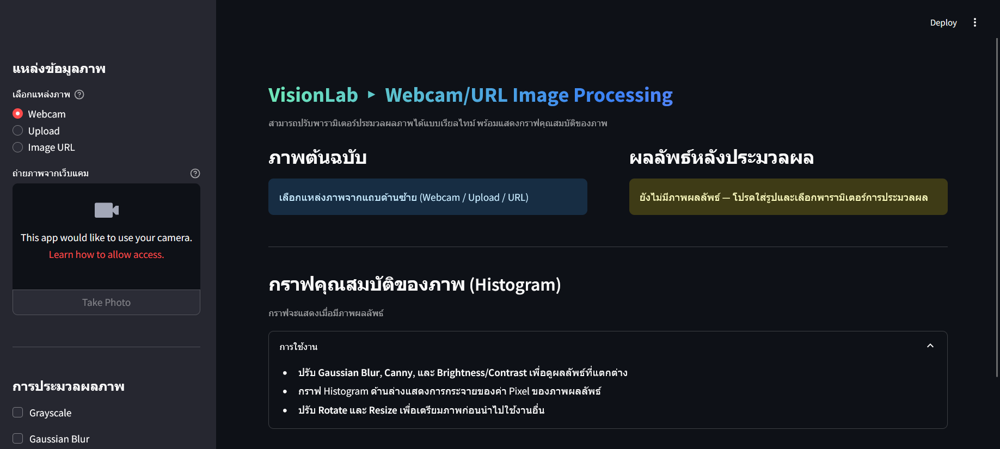

# Streamlit Image Processing Workbench

สำหรับทดลองประมวลผลภาพ ซึ่งรองรับทั้งรูปจากเว็บแคม อัปโหลดไฟล์ หรือดึงผ่าน URL และปรับพารามิเตอร์ต่าง ๆ ได้แบบเรียลไทม์ พร้อมพรีวิวผลลัพธ์และกราฟ Histogram ของภาพที่ประมวลผลแล้ว

## ผู้พัฒนา

6510110311 พัทธดนย์ หนุดทอง

## ฟีเจอร์หลัก

- แหล่งภาพให้เลือก 3 แบบ: Webcam, Upload, Image URL
- ประมวลผลภาพด้วยตัวเลือก: Grayscale, Gaussian Blur, Canny Edge, Brightness/Contrast
- ปรับขนาด (Resize) และหมุนภาพ (Rotate) ได้
- แสดงภาพ Original vs Processed
- สร้าง Histogram (Grayscale หรือ RGB) จากภาพผลลัพธ์
- แสดงค่าสถิติย่อ: Mean intensity, Standard deviation, Edge density
- ดาวน์โหลดผลลัพธ์เป็นไฟล์ PNG

## โครงสร้างไฟล์

```
TheRapidPrototype-UsingStreamlit/
├── app.py  
└── README.md   
```

## การติดตั้งและรัน

1. ติดตั้งแพ็กเกจที่จำเป็น

```
pip install streamlit opencv-python pillow numpy matplotlib requests
```

2. รันแอป

```
streamlit run app.py
```

3. เปิดเบราว์เซอร์ ที่ http://localhost:8501

## วิธีใช้งานในหน้าเว็บ

1. เลือกแหล่งรูปจาก Sidebar (Webcam / Upload / URL)
2. เมื่อมีภาพแล้ว ปรับตัวเลือกการประมวลผลทีละรายการ (ติ๊กแล้วเลื่อน Slider)
3. ภาพทางขวาจะอัปเดตผลทันที
4. เลื่อนลงด้านล่างเพื่อดู Histogram และค่าทางสถิติ
5. กด “ดาวน์โหลดภาพผลลัพธ์ (PNG)” หากต้องการบันทึก

## ฟังก์ชันการทำงาน

| กลุ่ม          | พารามิเตอร์  | คำอธิบาย                                                           |
| ------------------- | ----------------------- | -------------------------------------------------------------------------- |
| Grayscale           | Checkbox                | แปลงเป็นภาพเทา (1 channel) ก่อนขั้นตอนอื่น ๆ |
| Gaussian Blur       | Kernel (odd)            | ลดนอยส์/ทำภาพนุ่ม ใช้ค่า 3–11 บ่อยที่สุด  |
| Canny Edge          | Threshold1 / Threshold2 | ค่าต่ำ–สูง สำหรับตรวจเส้นขอบ (Edge)             |
| Brightness/Contrast | α / β                 | ปรับคอนทราสต์ (α) และความสว่าง (β)              |
| Resize              | Scale %                 | ย่อ/ขยายตามเปอร์เซ็นต์                                |
| Rotate              | Angle                   | หมุนรอบจุดกึ่งกลาง (องศา + ทวน, - ตามเข็ม) |

## Histogram

- Mean intensity: ค่าเฉลี่ยของพิกเซลทั้งหมด
- Std: ส่วนเบี่ยงเบนมาตรฐานของความเข้ม
- Edge density: สัดส่วนพิกเซลที่เป็นขอบ (เมื่อใช้ Canny หรือประเมินอัตโนมัติ)

## ตัวอย่างการทำงาน

- หน้าหลัก

  
- แสดงตัวอย่างผลการทำงาน

  

  
- ตัวอย่าง Histogram (ภาพที่มีสีสัน)

  
